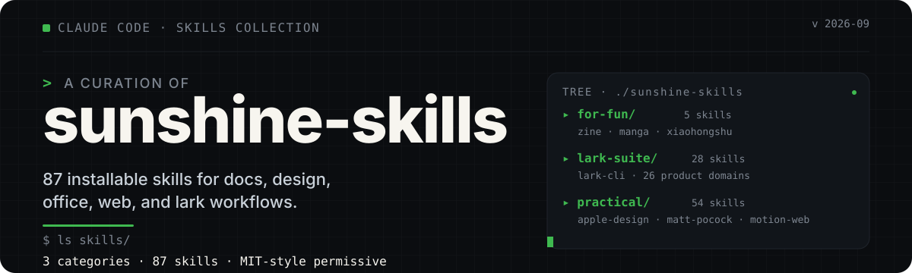
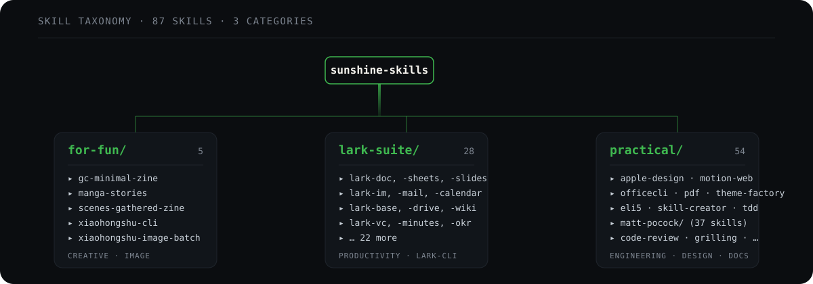

# sunshine-skills

<p align="center">
  
</p>

<p align="left">
  <a href="https://github.com/a-RunShine/sunshine-skills/stargazers"></a>
  <a href="https://github.com/a-RunShine/sunshine-skills/network/members"></a>
  <a href="https://github.com/a-RunShine/sunshine-skills/issues"></a>
  <a href="https://github.com/a-RunShine/sunshine-skills/commits/master"></a>
</p>

个人收集的 Claude Code Skills 集合。**87 个** skill，按用途分为三类：

- **for-fun/** — 创意 / 玩法类（zine、海报、小红书）
- **lark-suite/** — 飞书全场景 CLI（lark-cli，26 个业务域）
- **practical/** — 实用工具与开发流程（含 matt-pocock 工程 skill 集）

## 目录结构

<p align="center">
  
</p>

```text
sunshine-skills/
├── for-fun/                                # 玩法 / 创意类（5）
│   ├── gc-minimal-zine-poster-v0-1/        # Minimal Zine Poster v0.1 海报提示生成
│   ├── manga-stories/                      # 竖版 3:4 日式漫画风格图像集
│   ├── scenes-gathered-zine-v1-3/          # 照片转竖版 3:5 Gathereel 风海报
│   ├── xiaohongshu-cli/                    # 通过 xiaohongshu-cli 操作小红书
│   └── xiaohongshu-image-batch/            # 批量制作小红书图文（3:4 竖版，6–8 张一组）
│
├── lark-suite/                             # 飞书全场景 CLI（lark-cli，26 业务域，200+ 命令）
│   ├── SKILL.md                            # 入口
│   └── skills/                             # 28 个 lark-* 子 skill
│       ├── lark-approval/                  # 审批
│       ├── lark-apps/                      # 应用管理
│       ├── lark-attendance/                # 考勤
│       ├── lark-base/                      # 多维表格
│       ├── lark-calendar/                  # 日历
│       ├── lark-contact/                   # 通讯录
│       ├── lark-doc/                       # 文档
│       ├── lark-drive/                     # 云空间
│       ├── lark-event/                     # 日程事件
│       ├── lark-im/                        # 即时消息
│       ├── lark-mail/                      # 邮箱
│       ├── lark-markdown/                  # Markdown 渲染
│       ├── lark-minutes/                   # 妙记
│       ├── lark-note/                      # 笔记
│       ├── lark-okr/                       # OKR
│       ├── lark-openapi-explorer/          # OpenAPI 调试
│       ├── lark-shared/                    # 公共工具
│       ├── lark-sheets/                    # 电子表格
│       ├── lark-skill-maker/               # 技能制作器
│       ├── lark-slides/                    # 幻灯片
│       ├── lark-task/                      # 任务
│       ├── lark-vc/                        # 视频会议
│       ├── lark-vc-agent/                  # 视频会议智能体
│       ├── lark-whiteboard/                # 白板
│       ├── lark-wiki/                      # 知识库
│       ├── lark-workflow-meeting-summary/  # 工作流：会议纪要
│       └── lark-workflow-standup-report/   # 工作流：站会报告
│
└── practical/                              # 实用工具与开发流程（54）
    │
    │  # ── 独立 skills（17）──
    ├── apple-design/                       # Apple 风格的交互动效与排版设计
    ├── eli5/                               # 像给 5 岁孩子那样解释概念
    ├── find-skill/                         # 查找并安装 agent skills（本地缓存）
    ├── find-skills/                        # 同上（skill-creator 体系）
    ├── frontend-design/                    # 有设计感的 UI 视觉指导
    ├── humanizer-zh/                       # 去除中文文本的 AI 生成痕迹
    ├── motion-web/                         # 动效优先的创意网站（Framer Motion / GSAP / R3F）  [submodule]
    ├── officecli/                          # 创建 / 分析 / 修改 Office 文档（.docx/.xlsx/.pptx）
    ├── oil-icon/                           # 一套透明背景的图标集（按品牌风格）
    ├── pdf/                                # PDF 读取、合并、拆分、OCR、加密等
    ├── skill-creator/                      # 创建 / 改进 / 评测 skill 的元技能
    ├── sunshine-spec/                      # Spec 驱动开发（spec.md → plan.md → 验收）
    ├── theme-factory/                      # 为产物套用主题（10 套预设 + 自定义）
    ├── understand-codebase/                # 为陌生代码库生成蓝图
    ├── web-artifacts-builder/              # 多组件 HTML artifact（React + Tailwind + shadcn/ui）
    ├── web-design-guidelines/              # 按 Web Interface Guidelines 审查 UI
    └── writing-great-skills/               # 编写 / 编辑 skill 的词汇与方法
    │
    └── matt-pocock/                        # Matt Pocock 风格的工程 skill 集（37）
        ├── ask-matt/                       # 面向 Matt 风格的提问 / 咨询
        ├── claude-handoff/                 # 将当前会话压缩为交接文档
        ├── code-review/                    # 双轴审查（Standards + Spec，并行子代理）
        ├── codebase-design/                # 深度模块的共享词汇
        ├── diagnosing-bugs/                # 难 bug 与性能回归诊断循环
        ├── domain-modeling/                # 构建 / 打磨项目领域模型
        ├── git-guardrails-claude-code/     # Claude Code 的 Git 安全护栏
        ├── grill-me/                       # 不留情面的访谈来打磨方案
        ├── grill-with-docs/                # 带文档依据的访谈式打磨
        ├── grilling/                       # 对方案 / 决策 / 想法连环追问
        ├── handoff/                        # 将会话压成交接文档（同 claude-handoff）
        ├── implement/                      # 基于 spec / tickets 实现工作
        ├── implement-spec/                 # 从 spec 直接进入实现
        ├── improve-codebase-architecture/  # 扫描代码库深度化机会并出具 HTML 报告
        ├── loop-me/                        # 进入循环 / 反馈迭代
        ├── migrate-to-shoehorn/            # 迁移到 shoehorn 模式
        ├── pr/                             # PR 描述 / 评审辅助
        ├── prototype/                      # 一次性原型，验证状态模型或 UI
        ├── research/                       # 按一手资料调研并沉淀为 Markdown
        ├── resolving-merge-conflicts/      # 解决进行中的 merge / rebase 冲突
        ├── retro/                          # 复盘
        ├── scaffold-exercises/             # 脚手架式练习题
        ├── setup-matt-pocock-skills/       # 安装 Matt Pocock 全套 skill 的引导
        ├── setup-pre-commit/               # 配置 pre-commit
        ├── setup-ts-deep-modules/          # 配置 TS 深度模块工程
        ├── tdd/                            # 测试驱动开发（red-green-refactor）
        ├── teach/                          # 在工作区中教用户新概念
        ├── to-questionnaire/               # 内容 → 问卷
        ├── to-spec/                        # 内容 → spec.md
        ├── to-tickets/                     # 内容 → 工单
        ├── triage/                         # 工单 / 议题分诊
        ├── wait-what/                      # 暂停并梳理"等等，这是什么"
        ├── wayfinder/                      # 在大型代码库中定位方向
        ├── wizard/                         # 生成交互式 bash 引导脚本
        ├── writing-beats/                  # 按节拍写作
        ├── writing-for-agents/             # 为 agent 撰写文档（skill / AGENTS.md）
        ├── writing-fragments/              # 片段式写作
        └── writing-shape/                  # 形态导向的写作
```

## 添加方式

```bash
# 把整个目录复制到 Claude Code 的 skills 路径下
cp -r <skill-name> ~/.claude/skills/

# 或在 Claude Code 中通过 find-skill / find-skills 直接搜索安装
```

## License

各 skill 遵循其自带的 LICENSE / license 字段（见各子目录）。

---

> ⚠️ 注意：`find-skill/` 内的 `agents/openai.yaml` 来自原 `claude-skill-find-skill/`，合并前先保留以备回退。
