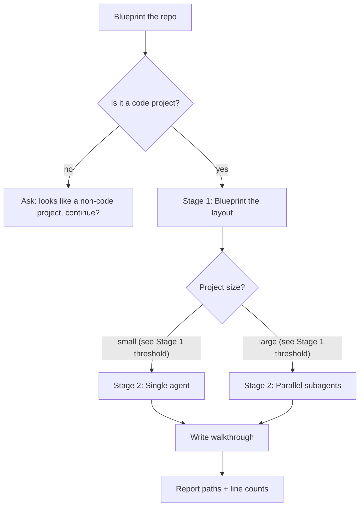

# understand-codebase

Blueprint an unfamiliar codebase. Three artifacts land in `./.arch-docs/`.

| 文件 | 角色 |
|---|---|
| `ARCHITECTURE.md` | 蓝图：项目是什么、用什么栈、模块怎么连 |
| `modules/<name>.md` | 档案：每个核心模块的详细解释 |
| `LEARNING_PATH.md` | 走读：3 条学习路径（5 分钟 / 30 分钟 / 深入贡献）+ 时间估算 |

## Inputs and outputs

- **Input**: current working directory, or `$ARGUMENTS` (a path)
- **Output dir**: `./.arch-docs/`. If it already exists, ask the user (overwrite / incremental / skip).

## Workflow



## Stage 1 — Blueprint the layout

**Action**: walk through the project to identify language, framework, and module boundaries.

**Threshold for the size decision**: small projects have **≤ 8 modules AND ≤ 100K lines**. Either limit breached → spawn subagents. (This threshold is the single source of truth — referenced by the Workflow mermaid diagram.)

**Completion criterion** (each must be true before Stage 2):
- Root manifest identified (e.g. `package.json`, `pyproject.toml`, `go.mod`, `Cargo.toml`, `pom.xml`, `*.csproj`, `pubspec.yaml`, `composer.json`, `Gemfile`, `Mix.exs`)
- Top-level directory structure listed
- Candidate module list of size M produced, each with a 1-line reason
- Project line count estimated
- Decision made: single agent OR parallel subagents (based on the threshold above)

**Recognition toolkits** (load on demand):
- `references/manifest-conventions.md` — manifest → language/framework lookup
- `references/module-recognition.md` — per-language module-cut rules

## Stage 2 — Write the dossier

**Action**: produce the three artifacts.

**Completion criterion** (each must be true before reporting back):
- `ARCHITECTURE.md` exists, written from `references/template-architecture.md`, covers **all 7 sections** in the template: 定位 / 技术栈 / 顶层架构图 / 数据流 / 模块索引 / 关键设计决策 / 部署·运行·测试. Agent self-check: H2 count in `ARCHITECTURE.md` matches the H2 count in the template.
- `LEARNING_PATH.md` exists, written from `references/template-learning-path.md`, covers **3 paths** (5 min / 30 min / 深入贡献) + 跳过建议 + 时间估算. Agent self-check: H2 count matches the template.
- `modules/<name>.md` exists for each of the M modules, written from `references/template-module.md`, each covers **7 required sections + 1 conditional** (内部架构图标"按需"). Agent self-check: H2 count in each `modules/<name>.md` matches the template's 8 H2s.
- Mermaid diagrams appear only where they add structure or flow the words cannot carry
- Every module name in the index table links to its `modules/<name>.md`
- Total document line count and the subagent count are reported

### Parallel subagents path

Spawn one `general-purpose` subagent per module, **in batches of 5 concurrent** (5 is an experience-based cap to keep each batch's context within budget; lower to 3 if rate limits or context overflow occur). Subagent prompt:

```
Read <module_path> only. Output 1 markdown document following this template exactly: <paste references/template-module.md body>. Constraints:
- facts only, no code-quality judgments
- Chinese
- Mermaid where it helps comprehension
- output markdown content, do not write files
```

Wait for all subagents; aggregate their outputs into `./.arch-docs/modules/<name>.md`.

## Reporting back

When all criterion items are satisfied, output a short summary. Do not paste document contents into chat — files are already written.

```
Blueprint complete.

Location: ./.arch-docs/
- ARCHITECTURE.md         (N lines)
- LEARNING_PATH.md        (N lines)
- modules/<m1>.md         (N lines)
- modules/<m2>.md         (N lines)
- ...

Project: <name>, ~<N> lines of code, M core modules.
Subagents used: <count>.

Next: read `./.arch-docs/LEARNING_PATH.md`'s 5-minute path first.
```

## References (load on demand)

| File | When to load |
|---|---|
| `references/manifest-conventions.md` | Stage 1, identifying language/framework |
| `references/module-recognition.md` | Stage 1, cutting module boundaries |
| `references/template-architecture.md` | Stage 2, writing `ARCHITECTURE.md` |
| `references/template-module.md` | Stage 2, writing each `modules/<name>.md` |
| `references/template-learning-path.md` | Stage 2, writing `LEARNING_PATH.md` |
| `references/depth-boundaries.md` | Stage 2, deciding what to read and skip |

## Style

- **Facts only**, not code-quality judgments
- **Lead with the positive** — describe what each file/decision does
- **Mermaid only when it adds structure or flow** the words can't carry
- **Engineering-doc voice** throughout
- **Unread files must be marked** in the dossier: `未深入：<path>`
- **Chinese** for all generated documentation

## Failure handling

| Situation | Action |
|---|---|
| No manifest found | AskUserQuestion: "looks like a non-code project, continue?" |
| Project has 1-2 files | AskUserQuestion: "very small, still want a blueprint?" |
| `./.arch-docs/` exists | AskUserQuestion: overwrite / incremental / skip |
| Read permission denied | Skip the file, list it in the final report |
| Single module > 50K lines | Describe only the top-level structure; mark "详见源码" |
| User cancels mid-run | Stop; leave partial `./.arch-docs/` for the user to decide |
| Subagent returns empty | Retry once; if still empty, write a placeholder `modules/<name>.md` noting "subagent failed, manual review needed" |
| Subagent times out | Same as above |
| `references/` template file missing | Report which file is missing; fall back to writing from the prose description in SKILL.md (do not block the run) |
