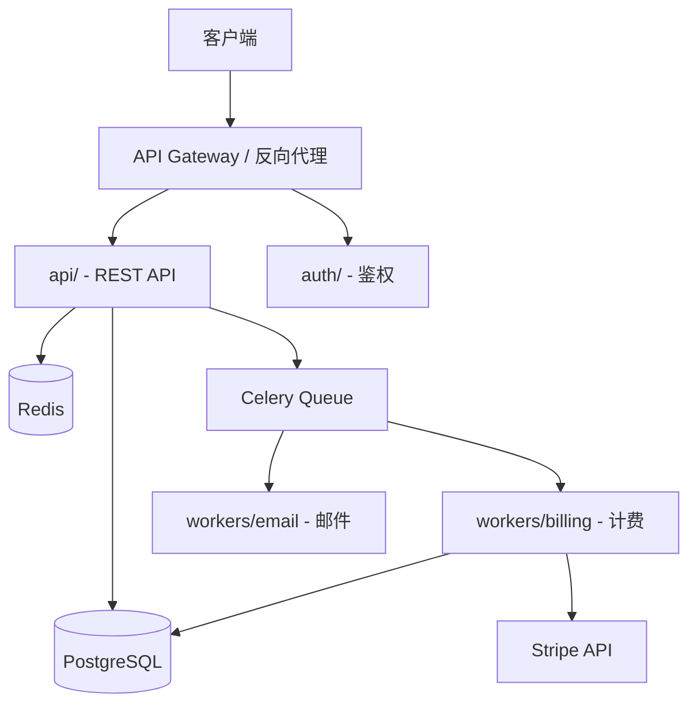
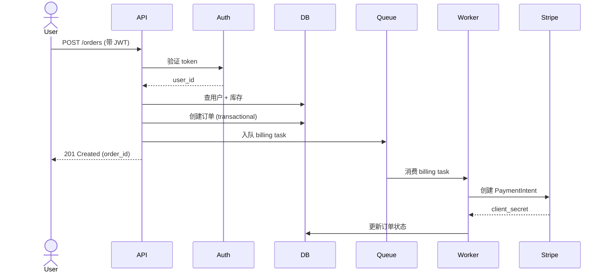

# ARCHITECTURE.md 模板（蓝图 / Blueprint）

> Stage 2 写 `ARCHITECTURE.md` 时加载。Lead word：**blueprint**——把项目作为"一张可读的蓝图"画出来。

---

# <项目名> — Architecture Blueprint

> 生成时间：<YYYY-MM-DD> · 基于 <commit SHA 或 "当前 main 分支">
> 项目规模：约 <N> 行代码 · <M> 个核心模块

## 1. 项目一句话定位

> 用 **一句话** 说清楚：项目是什么、给谁用、解决什么问题。

**例**：
> 这是一个基于 FastAPI + SQLAlchemy 的多用户 SaaS 后端，提供 RESTful API 管理用户、订单和订阅，通过 Stripe 处理支付，部署在 AWS ECS 上。

## 2. 技术栈清单

### 2.1 语言与运行时
- **语言**：<Python 3.11>
- **运行时**：<Node.js 20 / Python 3.11 / Go 1.22 / ...>

### 2.2 框架与关键库
| 类别 | 名称 | 用途 |
|---|---|---|
| Web 框架 | <FastAPI> | <HTTP API 框架> |
| ORM | <SQLAlchemy> | <数据库访问> |
| 数据库 | <PostgreSQL 15> | <主存储> |
| 缓存 | <Redis 7> | <会话/限流> |
| 任务队列 | <Celery + Redis> | <异步任务> |
| 鉴权 | <JWT (PyJWT)> | <无状态 token 认证> |
| 日志 | <structlog> | <结构化日志> |
| 测试 | <pytest + httpx> | <单元 + 集成测试> |
| 部署 | <Docker + AWS ECS> | <容器化部署> |

### 2.3 关键依赖（从 manifest 提取）
列出 manifest 里 5-10 个最关键依赖 + 用途；只列"项目离不开"的，避免噪声。

## 3. 顶层架构图

> 用 Mermaid 画"模块怎么连起来"。
> - 节点=模块（用 `services/api`、`workers/billing` 这种格式）
> - 边=主要调用/数据流方向
> - 外部依赖（DB、Redis、第三方 API）也要画出来
> - **Cap at 15 nodes for legibility**（超过会看不清）



## 4. 数据流（典型请求路径）

> 画 1-2 个最典型请求的 sequenceDiagram（如"用户下单""用户登录"）



## 5. 模块索引

| 模块 | 一句话职责 | 详细档案 |
|---|---|---|
| `<name>` | <职责> | [modules/<name>.md](./modules/<name>.md) |
| `<name>` | <职责> | [modules/<name>.md](./modules/<name>.md) |
| ... | ... | ... |

> 每个模块的详细档案在 `modules/<name>.md`（跳转阅读）

## 6. 关键设计决策

> 列出 3-5 个最影响架构的设计选型。格式：**决策 → 理由 → 替代方案**。

**例**：
1. **PostgreSQL 而非 MongoDB** → 强事务 + 关系数据是核心 + 团队熟悉 SQL。替代方案是 MongoDB（schema-less 灵活）但事务支持弱
2. **JWT 而非 session cookie** → 多端（Web + iOS + Android）需要无状态认证。替代方案是 session（更安全但需要 sticky session / 共享存储）
3. **Celery 而非 RQ / Dramatiq** → 成熟度高 + 生态完善 + 团队已有经验。替代方案是 RQ（更轻量）或 Dramatiq（更现代）

> 这些推断基于代码事实（manifest、import、配置）。如果推断错了请指正。

## 7. 部署 / 运行 / 测试

### 7.1 怎么跑起来
```bash
# 1. 安装依赖
<command>

# 2. 启动数据库
<command>

# 3. 跑迁移
<command>

# 4. 启动服务
<command>
```

### 7.2 怎么部署
- 平台：<AWS ECS / Kubernetes / Docker Compose / ...>
- 关键文件：<Dockerfile、.github/workflows/deploy.yml、terraform/>
- 环境变量：<列出关键环境变量和含义>

### 7.3 怎么跑测试
```bash
# 单元测试
<command>

# 集成测试
<command>

# 端到端测试
<command>
```

### 7.4 CI/CD
- 平台：<GitHub Actions / GitLab CI / CircleCI>
- 流程：<push → lint + test → build → deploy staging → manual approve → deploy prod>

---

> **下一步**：看 [LEARNING_PATH.md](./LEARNING_PATH.md) 选一条路径开始读代码。
