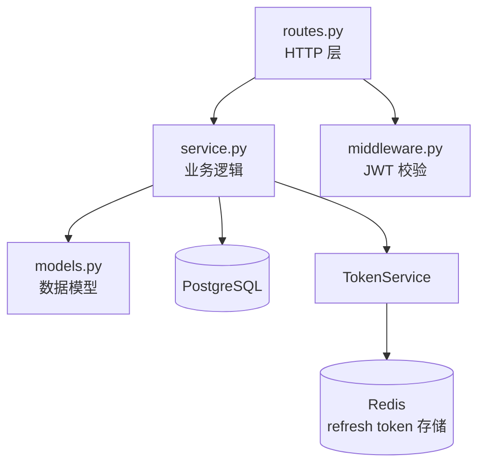
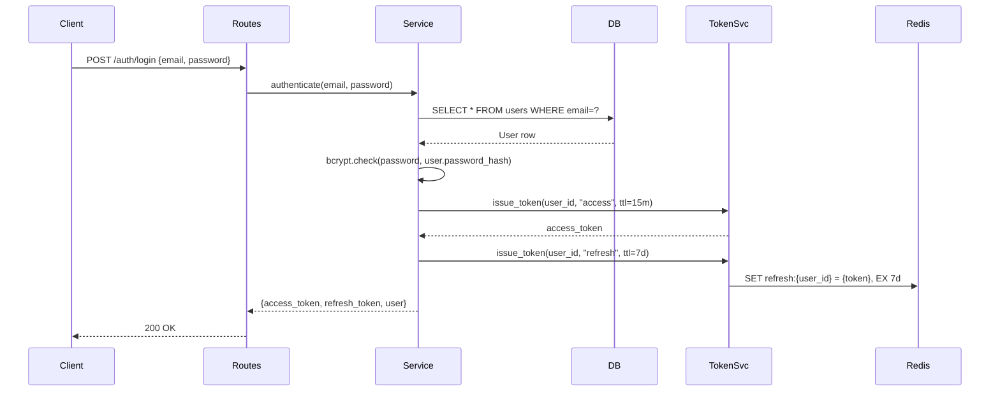

# modules/<name>.md 模板（档案 / Dossier）

> Stage 2 写每个模块的详细文档时加载。Lead word：**dossier**——把模块作为"一份完整的档案"展开。

---

# 模块：<name>（Dossier）

> 路径：`<relative/path/to/module>`
> 规模：<约 N 行> · <M 个文件> · 主要语言：<Python/TS/Go/...>

## 1. 定位

> 用 **一句话** 讲清楚这模块负责什么。

**例**：
> 负责用户身份认证、token 签发与刷新、密码重置、JWT 中间件。

## 2. 关键文件清单

| 文件路径 | 一句话作用 |
|---|---|
| `<path>/__init__.py` | 暴露对外 API |
| `<path>/models.py` | 数据库模型（User、Session、Token） |
| `<path>/service.py` | 核心业务逻辑（注册/登录/刷新） |
| `<path>/routes.py` | HTTP 路由绑定 |
| `<path>/middleware.py` | JWT 校验中间件 |
| `<path>/tests/test_service.py` | 单元测试 |

> 列出 5-10 个最重要的文件 + 一句话作用。完整文件列表用 `tree <path>` 看。

## 3. 核心类 / 函数 / 接口

> 列出这个模块**对外暴露**的核心 API（其他模块会调用的）。

### 3.1 类
| 类名 | 职责 | 关键方法 |
|---|---|---|
| `UserService` | 用户 CRUD 业务逻辑 | `create_user()`, `authenticate()`, `update_password()` |
| `TokenService` | JWT 签发与校验 | `issue_token()`, `verify_token()`, `refresh_token()` |

### 3.2 函数（无类）
| 函数名 | 签名 | 作用 |
|---|---|---|
| `require_auth` | `(request) -> User` | 中间件：从 JWT 提取当前用户 |
| `hash_password` | `(plain: str) -> str` | bcrypt 哈希 |

### 3.3 HTTP 接口（如适用）
| 方法 | 路径 | 作用 |
|---|---|---|
| POST | `/api/v1/auth/register` | 注册 |
| POST | `/api/v1/auth/login` | 登录，返回 JWT |
| POST | `/api/v1/auth/refresh` | 刷新 token |

## 4. 内部架构图（按需）

> 用 Mermaid 画模块内部子结构。**仅在模块大到有必要时画**；小模块跳过此节。



## 5. 依赖关系

### 5.1 被谁依赖（调用方）
- `modules/api/users.py` — 创建用户时调 `UserService.create_user`
- `modules/api/orders.py` — 下单时调 `require_auth` 中间件
- `workers/email.py` — 发送邮件前调 `UserService.get_by_id`

### 5.2 依赖谁（被调用方）
- `modules/common/db.py` — 数据库连接池
- `modules/common/redis.py` — Redis 客户端
- 外部：`bcrypt` 库、`PyJWT` 库

## 6. 数据流

> 画 1 个本模块最典型操作的 sequenceDiagram（"用户登录"是个经典例子）。



## 7. 关键设计决策

> 列出 1-2 个本模块最影响实现的设计选型。格式：**决策 → 理由 → 替代方案**。

**例**：
1. **Refresh token 存 Redis 而非 DB** → 自动过期（Redis TTL） + 可即时吊销（DEL key）。替代方案是 DB（持久但需自己管理过期 + 清理任务）
2. **bcrypt 而非 argon2** → 库成熟、文档多、团队有经验。替代方案是 argon2（更现代但学习曲线略高）

> 这些推断基于代码事实。如果推断错了请指正。

## 8. 测试覆盖 + 入门调用例子

### 8.1 测试覆盖
- 测试目录：`<path>/tests/`（或项目根 `tests/`）
- 关键测试文件：
  - `test_service.py` — 业务逻辑单元测试
  - `test_routes.py` — HTTP 路由集成测试
  - `test_middleware.py` — JWT 中间件测试
- 覆盖范围：注册、登录、token 刷新、密码重置、JWT 过期处理
- 跑测试：`<command>`

### 8.2 入门调用例子

**最简调用**（伪代码，展示其他模块怎么用）：
```python
# 其他模块要认证用户时
from modules.auth import require_auth
from modules.auth.service import UserService

# HTTP 路由
@router.post("/orders")
@require_auth  # 自动从 JWT 提取 user
def create_order(request, user: User):
    return OrderService.create(user_id=user.id, ...)

# 纯 Python 调用
user = UserService.authenticate(email="x@y.com", password="...")
if user:
    token = TokenService.issue_token(user.id, "access")
```

---

> **回到** [ARCHITECTURE.md](../ARCHITECTURE.md)
